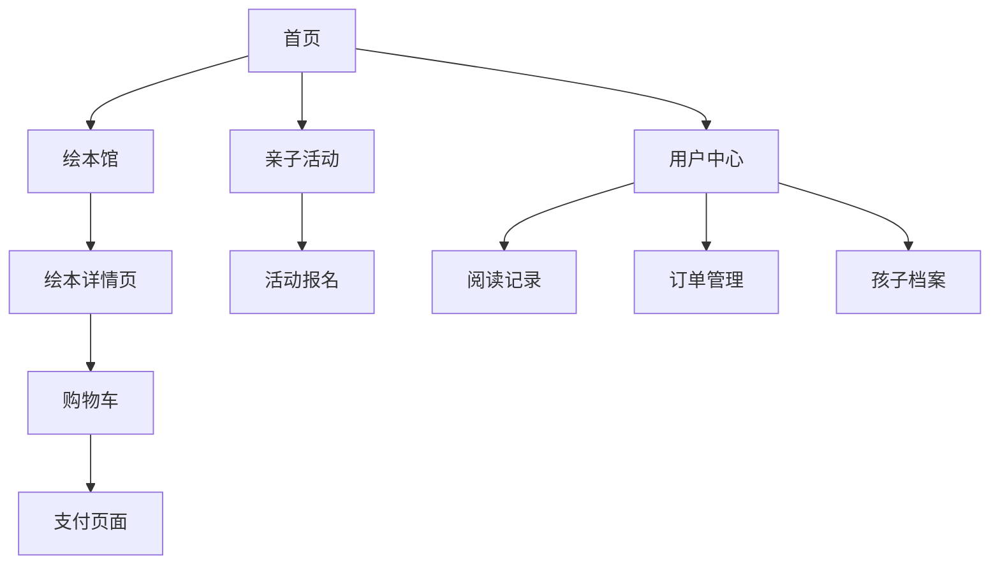

## 1. 产品概述

绘本岛（HuibenDAO）是一个专注于亲子阅读的移动平台，为中国家庭提供优质的绘本资源和亲子阅读体验。平台通过精选绘本内容、个性化推荐和丰富的亲子活动，帮助家长培养孩子的阅读兴趣，促进亲子关系发展。

核心价值主张：让每个家庭都能享受亲子阅读的乐趣，通过科技手段让优质绘本触手可及，为孩子的童年增添美好阅读回忆。

## 2. 核心功能

### 2.1 用户角色

| 角色 | 注册方式 | 核心权限 |
|------|----------|----------|
| 普通用户 | 手机号/微信/一键登录 | 浏览绘本、查看活动、基础功能 |
| 付费会员 | 订阅升级 | 解锁全部绘本、专属活动、个性化服务 |

### 2.2 功能模块

绘本岛平台包含以下核心页面：
1. **首页**：轮播图展示、热门绘本推荐、活动推荐、节日专题
2. **注册登录页**：手机号注册、微信登录、一键登录
3. **绘本馆**：分类展示、年龄段筛选、主题筛选、搜索排序
4. **绘本详情页**：封面展示、简介介绍、插画预览、适读年龄、用户评论
5. **亲子活动页**：线下活动发布、活动报名、地区筛选
6. **阅读记录页**：阅读足迹、打卡记录、读后感分享
7. **用户中心**：孩子档案管理、活动订单、收货地址管理
8. **购物流程页**：购物车、支付页面、订单管理

### 2.3 页面详情

| 页面名称 | 模块名称 | 功能描述 |
|----------|----------|----------|
| 首页 | 轮播图模块 | 自动轮播展示精选绘本、活动banner，支持手动滑动切换 |
| 首页 | 热门绘本推荐 | 基于用户偏好和热度算法推荐优质绘本 |
| 首页 | 活动推荐 | 展示最新亲子活动，支持一键报名 |
| 首页 | 节日专题 | 根据节日推出主题绘本合集 |
| 注册登录页 | 手机号注册 | 输入手机号、验证码完成注册 |
| 注册登录页 | 微信登录 | 微信授权快速登录 |
| 注册登录页 | 一键登录 | 本机号码一键登录功能 |
| 绘本馆 | 分类展示 | 按故事、科普、习惯养成等分类展示 |
| 绘本馆 | 年龄段筛选 | 0-3岁、3-6岁、6-9岁等年龄段筛选 |
| 绘本馆 | 主题筛选 | 情绪管理、安全教育、传统文化等主题 |
| 绘本馆 | 搜索排序 | 关键词搜索、按热度/评分/时间排序 |
| 绘本详情页 | 封面展示 | 高清封面图展示，支持放大查看 |
| 绘本详情页 | 简介介绍 | 绘本故事梗概、作者信息、获奖情况 |
| 绘本详情页 | 插画预览 | 精选插画页面预览，支持左右滑动 |
| 绘本详情页 | 适读年龄 | 明确标注适合的年龄段 |
| 绘本详情页 | 用户评论 | 查看和发表阅读感受，支持点赞 |
| 亲子活动页 | 活动列表 | 展示线下活动信息，包含时间地点 |
| 亲子活动页 | 活动报名 | 填写报名信息，支持多人报名 |
| 亲子活动页 | 地区筛选 | 按城市区域筛选附近活动 |
| 阅读记录页 | 阅读足迹 | 记录已读绘本，显示阅读进度 |
| 阅读记录页 | 打卡记录 | 每日阅读打卡，连续打卡奖励 |
| 阅读记录页 | 读后感分享 | 发表读后感，支持图文编辑 |
| 用户中心 | 孩子档案 | 管理孩子基本信息、阅读偏好 |
| 用户中心 | 活动订单 | 查看已报名活动订单状态 |
| 用户中心 | 收货地址 | 管理收货地址，支持默认地址设置 |
| 购物流程页 | 购物车 | 添加绘本到购物车，数量调整 |
| 购物流程页 | 支付页面 | 选择支付方式，完成订单支付 |
| 购物流程页 | 订单管理 | 查看订单状态、物流信息 |

## 3. 核心流程

### 用户注册登录流程
用户首次访问 → 选择注册方式（手机号/微信/一键登录）→ 完善基本信息 → 进入首页

### 绘本浏览购买流程
浏览绘本 → 查看详情 → 加入购物车或直接购买 → 选择支付方式 → 完成支付 → 查看订单

### 亲子活动报名流程
浏览活动 → 查看详情 → 点击报名 → 填写报名信息 → 确认报名 → 支付费用（如有）→ 报名成功

### 阅读记录管理流程
开始阅读 → 记录阅读进度 → 发表读后感 → 打卡签到 → 查看阅读统计

## 4. 用户界面设计

### 4.1 设计风格

**色彩方案：**
- 主色调：米白色 (#FAF8F3) - 营造温馨舒适的阅读氛围
- 辅助色：淡黄色 (#FFE4B5) - 增加温暖感，模拟书香气息
- 强调色：天蓝色 (#87CEEB) - 代表童真和想象力
- 文字色：深棕色 (#4A4A4A) - 确保阅读清晰度

**视觉元素：**
- 按钮样式：圆角矩形，3D微立体效果，增加童趣感
- 字体选择：优先使用圆体字体，标题可用手写风格字体
- 布局风格：卡片式布局，留白充足，营造轻松感
- 图标风格：手绘风格图标，线条柔和，色彩温暖

### 4.2 页面设计概述

| 页面名称 | 模块名称 | UI元素设计 |
|----------|----------|------------|
| 首页 | 轮播图模块 | 全屏宽度，高度占屏幕30%，自动切换间隔3秒，底部指示器 |
| 首页 | 热门绘本推荐 | 横向滑动卡片，每行2个，卡片圆角12px，阴影效果 |
| 首页 | 活动推荐 | 纵向列表，左图右文，图片圆角8px，标题使用天蓝色 |
| 绘本馆 | 分类导航 | 宫格布局，图标+文字，背景淡黄渐变 |
| 绘本馆 | 筛选器 | 顶部标签式筛选，选中状态天蓝色背景 |
| 绘本详情页 | 封面展示 | 居中显示，最大宽度80%，支持手势放大 |
| 绘本详情页 | 插画预览 | 横向滑动画廊，缩略图底部显示 |
| 亲子活动页 | 活动卡片 | 左图右文布局，时间地点图标化显示 |
| 阅读记录页 | 阅读统计 | 圆形进度条，打卡日历网格展示 |
| 用户中心 | 个人信息 | 头像圆形显示，昵称大字体，孩子信息卡片化 |

### 4.3 响应式设计

**移动端优先设计原则：**
- 基础断点：375px（iPhone SE）到 414px（iPhone Plus）
- 平板适配：768px 以上采用两栏布局
- 交互动效：按钮点击波纹效果，页面切换滑动动画
- 手势操作：支持左右滑动切换、下拉刷新、上拉加载更多
- 触摸优化：按钮最小点击区域 44px × 44px，避免误触

**特殊适配：**
- 阅读模式：支持横屏阅读，自动调整字体大小
- 夜间模式：自动切换深色主题，保护孩子视力
- 无图模式：网络不佳时显示占位图，支持离线缓存