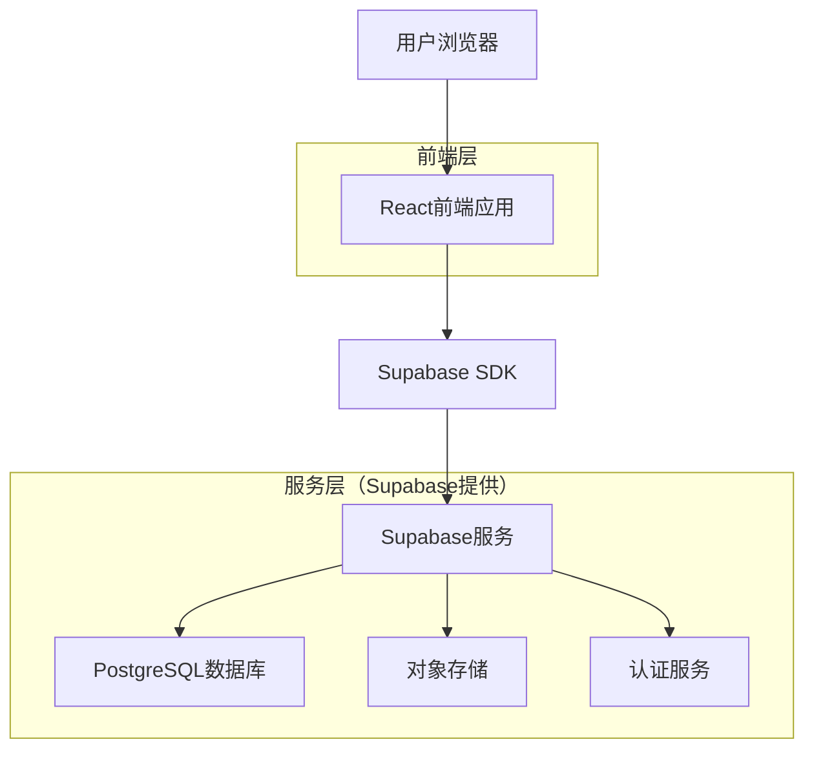
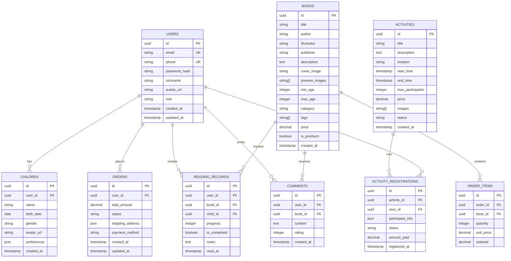

## 1. 架构设计



## 2. 技术栈描述

**前端技术：**
- React@18 + TypeScript + Vite - 现代化前端开发框架
- Tailwind CSS@3 - 实用优先的CSS框架
- Zustand - 轻量级状态管理
- React Router@6 - 路由管理
- Lucide React - 图标库

**后端服务：**
- Supabase - 后端即服务平台（包含数据库、认证、存储）

**开发工具：**
- ESLint + Prettier - 代码规范
- Husky + lint-staged - Git钩子
- Vitest - 单元测试框架

## 3. 路由定义

| 路由 | 用途 |
|------|------|
| / | 首页，展示轮播图、推荐绘本和活动 |
| /auth/login | 登录页面，支持多种登录方式 |
| /auth/register | 注册页面，手机号注册流程 |
| /books | 绘本馆，绘本分类浏览 |
| /books/:id | 绘本详情页，展示绘本信息和评论 |
| /activities | 亲子活动列表页面 |
| /activities/:id | 活动详情页，支持在线报名 |
| /reading-record | 阅读记录，个人阅读统计 |
| /profile | 用户中心，个人信息管理 |
| /profile/children | 孩子档案管理 |
| /profile/orders | 订单管理页面 |
| /cart | 购物车页面 |
| /checkout | 支付结算页面 |
| /search | 搜索页面，支持关键词搜索 |

## 4. 数据模型

### 4.1 数据模型定义



### 4.2 数据定义语言

**用户表 (users)**
```sql
-- 创建用户表
CREATE TABLE users (
    id UUID PRIMARY KEY DEFAULT gen_random_uuid(),
    email VARCHAR(255) UNIQUE,
    phone VARCHAR(20) UNIQUE,
    password_hash VARCHAR(255),
    nickname VARCHAR(100) NOT NULL,
    avatar_url TEXT,
    role VARCHAR(20) DEFAULT 'user' CHECK (role IN ('user', 'premium', 'admin')),
    created_at TIMESTAMP WITH TIME ZONE DEFAULT NOW(),
    updated_at TIMESTAMP WITH TIME ZONE DEFAULT NOW()
);

-- 创建索引
CREATE INDEX idx_users_email ON users(email);
CREATE INDEX idx_users_phone ON users(phone);
```

**孩子档案表 (children)**
```sql
-- 创建孩子档案表
CREATE TABLE children (
    id UUID PRIMARY KEY DEFAULT gen_random_uuid(),
    user_id UUID NOT NULL REFERENCES users(id) ON DELETE CASCADE,
    name VARCHAR(100) NOT NULL,
    birth_date DATE,
    gender VARCHAR(10) CHECK (gender IN ('male', 'female', 'other')),
    avatar_url TEXT,
    preferences JSONB DEFAULT '{}',
    created_at TIMESTAMP WITH TIME ZONE DEFAULT NOW()
);

-- 创建索引
CREATE INDEX idx_children_user_id ON children(user_id);
```

**绘本表 (books)**
```sql
-- 创建绘本表
CREATE TABLE books (
    id UUID PRIMARY KEY DEFAULT gen_random_uuid(),
    title VARCHAR(255) NOT NULL,
    author VARCHAR(255),
    illustrator VARCHAR(255),
    publisher VARCHAR(255),
    description TEXT,
    cover_image TEXT NOT NULL,
    preview_images TEXT[] DEFAULT '{}',
    min_age INTEGER DEFAULT 0,
    max_age INTEGER DEFAULT 12,
    category VARCHAR(100),
    tags TEXT[] DEFAULT '{}',
    price DECIMAL(10,2) DEFAULT 0,
    is_premium BOOLEAN DEFAULT false,
    created_at TIMESTAMP WITH TIME ZONE DEFAULT NOW()
);

-- 创建索引
CREATE INDEX idx_books_category ON books(category);
CREATE INDEX idx_books_age ON books(min_age, max_age);
CREATE INDEX idx_books_premium ON books(is_premium);
```

**活动表 (activities)**
```sql
-- 创建活动表
CREATE TABLE activities (
    id UUID PRIMARY KEY DEFAULT gen_random_uuid(),
    title VARCHAR(255) NOT NULL,
    description TEXT,
    location VARCHAR(255),
    start_time TIMESTAMP WITH TIME ZONE,
    end_time TIMESTAMP WITH TIME ZONE,
    max_participants INTEGER DEFAULT 0,
    price DECIMAL(10,2) DEFAULT 0,
    images TEXT[] DEFAULT '{}',
    status VARCHAR(20) DEFAULT 'upcoming' CHECK (status IN ('upcoming', 'ongoing', 'completed', 'cancelled')),
    created_at TIMESTAMP WITH TIME ZONE DEFAULT NOW()
);

-- 创建索引
CREATE INDEX idx_activities_status ON activities(status);
CREATE INDEX idx_activities_start_time ON activities(start_time);
```

**订单表 (orders)**
```sql
-- 创建订单表
CREATE TABLE orders (
    id UUID PRIMARY KEY DEFAULT gen_random_uuid(),
    user_id UUID NOT NULL REFERENCES users(id) ON DELETE CASCADE,
    total_amount DECIMAL(10,2) NOT NULL,
    status VARCHAR(50) DEFAULT 'pending' CHECK (status IN ('pending', 'paid', 'shipped', 'completed', 'cancelled')),
    shipping_address JSONB,
    payment_method VARCHAR(50),
    created_at TIMESTAMP WITH TIME ZONE DEFAULT NOW(),
    updated_at TIMESTAMP WITH TIME ZONE DEFAULT NOW()
);

-- 创建索引
CREATE INDEX idx_orders_user_id ON orders(user_id);
CREATE INDEX idx_orders_status ON orders(status);
CREATE INDEX idx_orders_created_at ON orders(created_at DESC);
```

**阅读记录表 (reading_records)**
```sql
-- 创建阅读记录表
CREATE TABLE reading_records (
    id UUID PRIMARY KEY DEFAULT gen_random_uuid(),
    user_id UUID NOT NULL REFERENCES users(id) ON DELETE CASCADE,
    book_id UUID NOT NULL REFERENCES books(id) ON DELETE CASCADE,
    child_id UUID REFERENCES children(id) ON DELETE CASCADE,
    progress INTEGER DEFAULT 0 CHECK (progress >= 0 AND progress <= 100),
    is_completed BOOLEAN DEFAULT false,
    notes TEXT,
    read_at TIMESTAMP WITH TIME ZONE DEFAULT NOW()
);

-- 创建索引
CREATE INDEX idx_reading_records_user_id ON reading_records(user_id);
CREATE INDEX idx_reading_records_book_id ON reading_records(book_id);
CREATE INDEX idx_reading_records_child_id ON reading_records(child_id);
CREATE INDEX idx_reading_records_read_at ON reading_records(read_at DESC);
```

**评论表 (comments)**
```sql
-- 创建评论表
CREATE TABLE comments (
    id UUID PRIMARY KEY DEFAULT gen_random_uuid(),
    user_id UUID NOT NULL REFERENCES users(id) ON DELETE CASCADE,
    book_id UUID NOT NULL REFERENCES books(id) ON DELETE CASCADE,
    content TEXT NOT NULL,
    rating INTEGER CHECK (rating >= 1 AND rating <= 5),
    created_at TIMESTAMP WITH TIME ZONE DEFAULT NOW()
);

-- 创建索引
CREATE INDEX idx_comments_user_id ON comments(user_id);
CREATE INDEX idx_comments_book_id ON comments(book_id);
CREATE INDEX idx_comments_created_at ON comments(created_at DESC);
```

### 4.3 权限配置

```sql
-- 为匿名用户授予基本读取权限
GRANT SELECT ON books TO anon;
GRANT SELECT ON activities TO anon;
GRANT SELECT ON comments TO anon;

-- 为认证用户授予完整权限
GRANT ALL PRIVILEGES ON users TO authenticated;
GRANT ALL PRIVILEGES ON children TO authenticated;
GRANT ALL PRIVILEGES ON orders TO authenticated;
GRANT ALL PRIVILEGES ON order_items TO authenticated;
GRANT ALL PRIVILEGES ON reading_records TO authenticated;
GRANT ALL PRIVILEGES ON comments TO authenticated;
GRANT ALL PRIVILEGES ON activity_registrations TO authenticated;
```

## 5. 前端架构设计

### 5.1 组件架构

```
src/
├── components/          # 通用组件
│   ├── common/       # 基础组件
│   ├── layout/       # 布局组件
│   └── ui/           # UI组件库
├── pages/             # 页面组件
├── hooks/             # 自定义钩子
├── stores/            # 状态管理
├── utils/             # 工具函数
├── services/          # API服务
├── types/             # TypeScript类型定义
└── assets/            # 静态资源
```

### 5.2 状态管理结构

**使用Zustand管理全局状态：**
- userStore: 用户信息和认证状态
- bookStore: 绘本数据和浏览状态
- cartStore: 购物车状态
- activityStore: 活动信息和报名状态
- readingStore: 阅读记录和进度

### 5.3 核心服务模块

**Supabase服务封装：**
- authService: 认证相关操作
- bookService: 绘本数据CRUD
- orderService: 订单管理
- activityService: 活动管理
- readingService: 